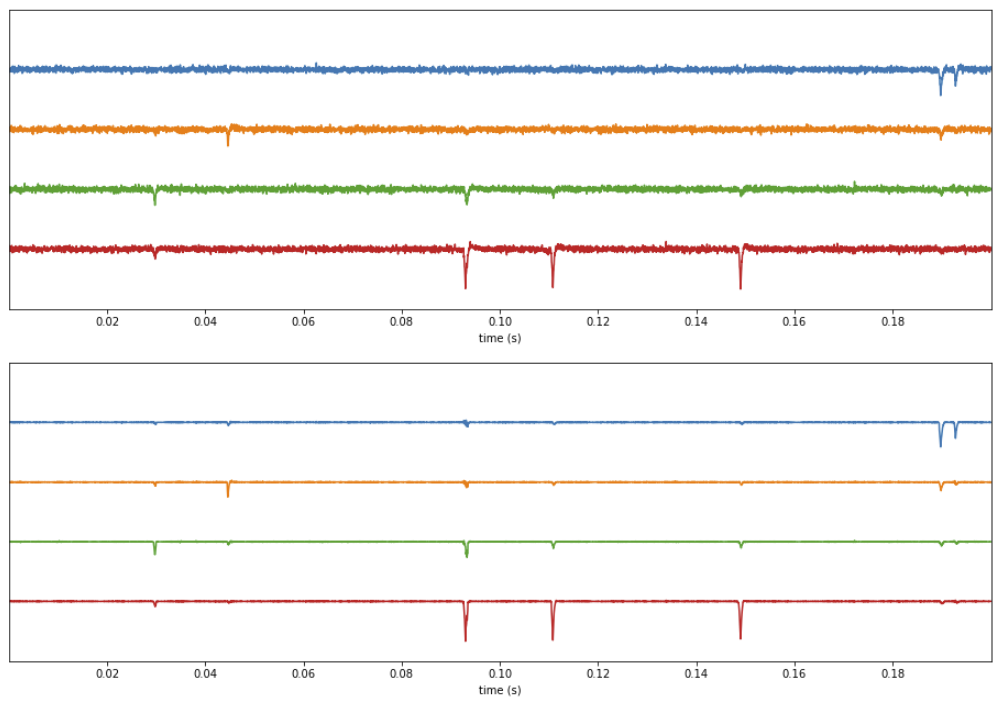

# ephys_nlm

Non-local means denoising of multi-channel electrophysiology timeseries using PyTorch.

The software is in the alpha stage of development. Testers and contributers are welcome to assist.

## About

Electrophysiology recordings contain spike waveforms
superimposed on a noisy background signal. Because a single neuron may fire
hundreds or even thousands of times within the duration of the recording
producing a very similar voltage trace at each firing, it should be possible
to use this redundancy to denoise the recording in a preprocessing step.
Our approach is to use non-local means to suppress the noisy signal while
retaining the part of the signal that repeats.

Non-local means is a denoising algorithm that has primarily been used for
2d images, but it can also be adapted for use with 1d signals.

TODO: finish writing this section

## Prerequisites

* Python (tested on 3.6 and 3.7)
* [PyTorch](https://pytorch.org/) (tested on v1.0.0)
* [CUDA toolkit](https://developer.nvidia.com/cuda-downloads) - if using GPU (recommended) 
* [MKL](https://software.intel.com/en-us/mkl) - if using CPU instead of CUDA

To test whether PyTorch and CUDA are set up properly, run the following in ipython:

```python
import torch
if torch.cuda.is_available():
    print('CUDA is available for PyTorch!')
else:
    print('CUDA is NOT available for PyTorch.')
```

**Recommended**

* [SpikeInterface](https://github.com/spikeinterface) -- `pip install spikeinterface`
* [SpikeForest](https://github.com/flatironinstitute/spikeforest2)

## Install from source

For now, install in development mode. After cloning this repository:

```bash
cd ephys_nlm
pip install -e .
```

Then in subsequent updates:

```bash
git pull
pip install -e .
```

# Example

The following is taken from a notebook in the [examples/](examples/) directory. It generates a short synthetic recording and denoise it.

```python
from ephys_nlm import ephys_nlm_v1, ephys_nlm_v1_opts

import spikeextractors as se
import spikewidgets as sw
import matplotlib.pyplot as plt

# Create a synthetic recording for purposes of demo
recording, sorting_true = se.example_datasets.toy_example(duration=30, num_channels=4, K=20, seed=4)

# Specify the denoising options
opts = ephys_nlm_v1_opts(
    multi_neighborhood=False, # False means all channels will be denoised in one neighborhood
    block_size_sec=30, # Size of block in seconds -- each block is denoised separately
    clip_size=30, # Size of a clip (aka snippet) in timepoints
    sigma='auto', # Auto compute the noise level
    sigma_scale_factor=1, # Scale factor for auto-computed noise level
    whitening='auto', # Auto compute the whitening matrix
    whitening_pctvar=90, # Percent of variance to retain - controls number of SVD components to keep
    denom_threshold=30 # Higher values lead to a slower but more accurate calculation.
)

# Do the denoising
recording_denoised, runtim_info = ephys_nlm_v1(
    recording=recording,
    opts=opts,
    device='cpu', # cuda is recommended for non-demo situations
    verbose=1
)
```

Also included in the notebook is SpikeInterface code used to view the original and denoised timeseries:

```python
# View the original and denoised timeseries

plt.figure(figsize=(16,5))
sw.TimeseriesWidget(recording=recording, trange=(0, 0.2), ax=plt.gca()).plot();

plt.figure(figsize=(16,5))
sw.TimeseriesWidget(recording=recording_denoised, trange=(0, 0.2), ax=plt.gca()).plot();
```

This should produce output similar to the following:



## Authors

Jeremy Magland
Center for Computational Mathematics, Flatiron Institute